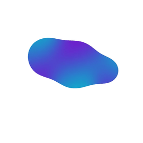

<p align="center">
  
</p>
<p align="center">
<h1 align="center">The gooey effect for React</h1>
</p>
The 'gooey effect' has been made popular by various (amazing) blogposts over the years. This tiny component makes it easy to use within React, and has improved the implementation as much as possible. It's optimized to be as sharp/crisp as possible, since existing implementations can be a bit blurry. Safari support (which can be notorious, and is usually missing) has been added as well.

## Installation (~0.5 KB)
```sh
npm install gooey-react
```

## Usage
```jsx
import Goo from 'gooey-react'

<Goo> … </Goo>
```
You can put regular HTML elements inside `Goo`, but using an SVG is recommended for better browser support. Shape blobbing will be applied to everything within the component.

[Visit the website](https://gooey-react.netlify.app/) for full documentation, properties and examples.
